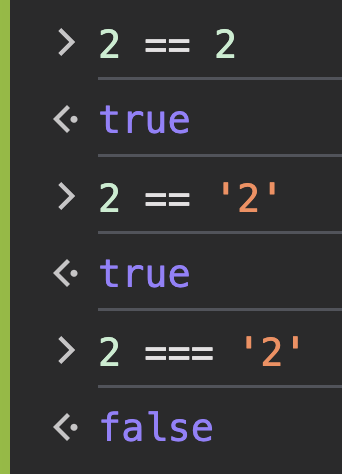

# Operadores

## de asignación =

> el símbolo = sirve para asignar un valor 

    let puntaje = 600  
    const contenedor = document.querySelector("#contenedor")  
    let respuesta = prompt('qué seleccionado ganó la copa del mundo Qatar 2022')  

## de comparación

    >  //mayor    
    >= // mayor o igual  
    <  // menor 
    <= // menor o igual   
    == // igual (comparación de igualdad simple)  
    === // igual (comparación de igualdad de tipo)  

